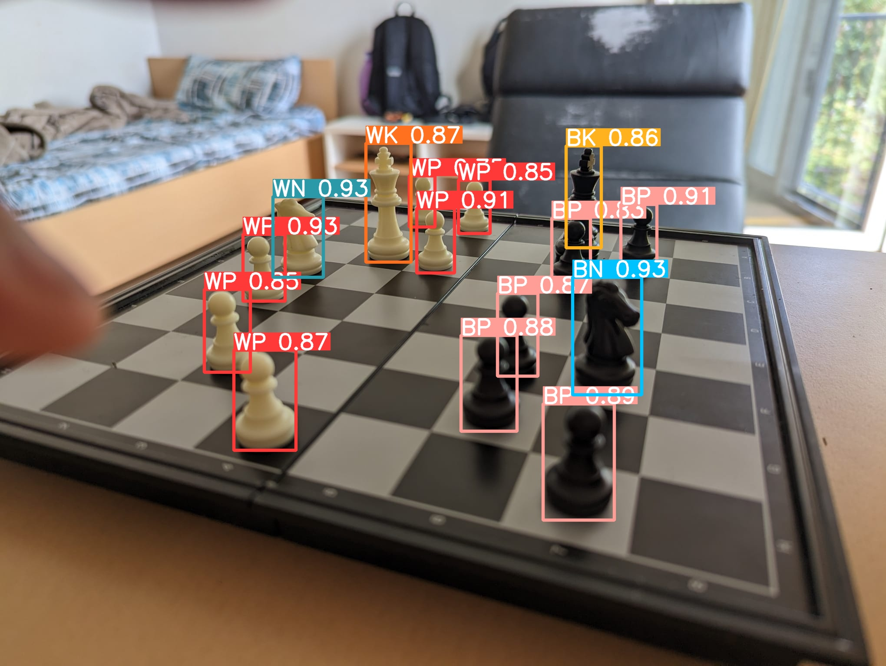

# Fischaugen

Realtime chess piece detection using YOLOv8 trained to handle complex cases such as pieces obstructing each other.

Please run test.bat to start the project. Make sure you have necessary dependencies installed (provided in requirements.txt) via pip.

## Metrics

## Examples

